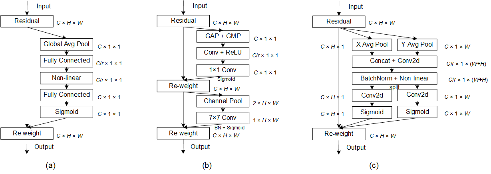

# Coordinate Attention for Efficient Mobile Network Design ([preprint](https://arxiv.org/abs/2103.02907))

This repository is a PyTorch implementation of our coordinate attention (will appear in CVPR2021).

Our coordinate attention can be easily plugged into any classic building blocks as a feature representation augmentation tool. Here ([pytorch-image-models](https://github.com/rwightman/pytorch-image-models)) is a code base that you might want to train a classification model on ImageNet.

Note that the results reported in the paper are based on regular training setting (200 training epochs, random crop, and cosine learning schedule) **without** using extra label smoothing, random augmentation, random erasing, mixup. For specific numbers in ImageNet classification, COCO object detection, and semantic segmentation, please refer to [our paper](https://arxiv.org/abs/2103.02907).


### Updates

- [Pretrained model](https://github.com/Andrew-Qibin/CoordAttention/blob/main/mbv2_ca.pth) (MobileNetV2 with CA) and [model file](https://github.com/Andrew-Qibin/CoordAttention/blob/main/mbv2_ca.py) are both available.

---

### Comparison to Squeeze-and-Excitation block and CBAM



(a) Squeeze-and-Excitation block      (b) CBAM      (C) Coordinate attention block


### How to plug the proposed CA block in the [inverted residual block](https://openaccess.thecvf.com/content_cvpr_2018/papers/Sandler_MobileNetV2_Inverted_Residuals_CVPR_2018_paper.pdf) and the [sandglass block](https://arxiv.org/pdf/2007.02269.pdf)


(a) MobileNetV2 (b) MobileNeXt


### Numerical results on ImageNet

| Method             | Params  |  M-Adds | Top 1 | Model |
| :----------------- | :------ | :------ | :---- | :---- |
| MobileNetV2-1.0    | 3.5M    | 300M    | 72.3  |       |
| MobileNetV2 + SE   | 3.89M   | 300M    | 73.5  |       |
| MobileNetV2 + CBAM | 3.89M   | 300M    | 73.6  |       |
| MobileNetV2 + CA   | 3.95M   | 310M    | 74.3  | [link](https://github.com/Andrew-Qibin/CoordAttention/blob/main/mbv2_ca.pth) |

| Method            | Params  |  M-Adds | Top 1 |
| :---------------- | :------ | :------ | :---- |
| MobileNeXt-1.0    | 3.5M    | 300M    | 74.0  |
| MobileNeXt + SE   | 3.89M   | 300M    | 74.7  |
| MobileNeXt + CA   | 4.09M   | 330M    | 75.2  |

[Pretrained model](https://github.com/Andrew-Qibin/CoordAttention/blob/main/mbv2_ca.pth) (MobileNetV2 with CA) and [model file](https://github.com/Andrew-Qibin/CoordAttention/blob/main/mbv2_ca.py) are both available.

### Some tips for designing lightweight attention blocks

- SiLU activation (h_swish in the code) works better than ReLU6 
- Either horizontal or vertical direction attention performs the same to the SE attention
- When applied to MobileNeXt, adding the attention block after the first depthwise 3x3 convolution works better
- Note sure whether the results would be better if a softmax is applied between the horizontal and vertical features

### Object detection

We use this [repo (ssdlite-pytorch-mobilenext)](https://github.com/Andrew-Qibin/ssdlite-pytorch-mobilenext).

Results on COCO val

| Model              | Method     |  Params | AP |
| :----------------- | :--------- | :------ | :---- |
| MobileNetV1        | SSDLite320 | 5.1M    | 22.2  |
| MobileNetV2        | SSDLite320 | 4.3M    | 22.3  |
| MobileNetV2        | SSDLite320 | 5.0M    | 22.0  |
| MnasNet-A1         | SSDLite320 | 4.9M    | 23.0  |
| MobileNeXt         | SSDLite320 | 4.4M    | 23.3  |
| MobileNetV2 + SE   | SSDLite320 | 4.7M    | 23.7  |
| MobileNetV2 + CBAM | SSDLite320 | 4.7M    | 23.0  |
| MobileNetV2 + CA   | SSDLite320 | 4.8M    | 24.5  |

Results on Pascal VOC 2007 test

| Model              | Method     |  Params | mAP |
| :----------------- | :--------- | :------ | :---- |
| MobileNetV2        | SSDLite320 | 4.3M    | 71.7  |
| MobileNetV2 + SE   | SSDLite320 | 4.7M    | 71.7  |
| MobileNetV2 + CBAM | SSDLite320 | 4.7M    | 71.7  |
| MobileNetV2 + CA   | SSDLite320 | 4.8M    | 73.1  |

### Semantic segmentation

We use this [repo](https://github.com/Andrew-Qibin/SPNet). You can also refer to [mmsegmentation](https://github.com/open-mmlab/mmsegmentation) alternatively.

Results on Pascal VOC 2012 val

| Model              | Method     | Stride | Params | mIoU  |
| :----------------- | :--------- | :------| :----- | :---- |
| MobileNetV2        | DeepLabV3  | 16     | 4.5    | 70.84 |
| MobileNetV2 + SE   | DeepLabV3  | 16     | 4.9    | 71.69 |
| MobileNetV2 + CBAM | DeepLabV3  | 16     | 4.9    | 71.28 |
| MobileNetV2 + CA   | DeepLabV3  | 16     | 5.0    | 73.32 |
| MobileNetV2        | DeepLabV3  | 8      | 4.5    | 71.82 |
| MobileNetV2 + SE   | DeepLabV3  | 8      | 4.9    | 72.52 |
| MobileNetV2 + CBAM | DeepLabV3  | 8      | 4.9    | 71.67 |
| MobileNetV2 + CA   | DeepLabV3  | 8      | 5.0    | 73.96 |


Results on Cityscapes val 

| Model              | Method     | Stride | Params | mIoU |
| :----------------- | :--------- | :------| :----- | :--- |
| MobileNetV2        | DeepLabV3  | 8      | 4.5    | 71.4 |
| MobileNetV2 + SE   | DeepLabV3  | 8      | 4.9    | 72.2 |
| MobileNetV2 + CBAM | DeepLabV3  | 8      | 4.9    | 71.4 |
| MobileNetV2 + CA   | DeepLabV3  | 8      | 5.0    | 74.0 |

We observe that our coordinate attention yields larger improvement on semantic segmentation than ImageNet classification and object detection. We argue that this is because our coordinate attention is able to capture long-range dependencies with precise postional information, which is more beneficial to vision tasks with dense predictions, such as semantic segmentation.


### Citation

You may want to cite:

```
@inproceedings{hou2021coordinate,
  title={Coordinate Attention for Efficient Mobile Network Design},
  author={Hou, Qibin and Zhou, Daquan and Feng, Jiashi},
  booktitle={CVPR},
  year={2021}
}

@inproceedings{sandler2018mobilenetv2,
  title={Mobilenetv2: Inverted residuals and linear bottlenecks},
  author={Sandler, Mark and Howard, Andrew and Zhu, Menglong and Zhmoginov, Andrey and Chen, Liang-Chieh},
  booktitle={Proceedings of the IEEE conference on computer vision and pattern recognition},
  pages={4510--4520},
  year={2018}
}

@inproceedings{zhou2020rethinking,
  title={Rethinking bottleneck structure for efficient mobile network design},
  author={Zhou, Daquan and Hou, Qibin and Chen, Yunpeng and Feng, Jiashi and Yan, Shuicheng}
  booktitle={ECCV},
  year={2020}
}

@inproceedings{hu2018squeeze,
  title={Squeeze-and-excitation networks},
  author={Hu, Jie and Shen, Li and Sun, Gang},
  booktitle={Proceedings of the IEEE conference on computer vision and pattern recognition},
  pages={7132--7141},
  year={2018}
}

@inproceedings{woo2018cbam,
  title={Cbam: Convolutional block attention module},
  author={Woo, Sanghyun and Park, Jongchan and Lee, Joon-Young and Kweon, In So},
  booktitle={Proceedings of the European conference on computer vision (ECCV)},
  pages={3--19},
  year={2018}
}
```
